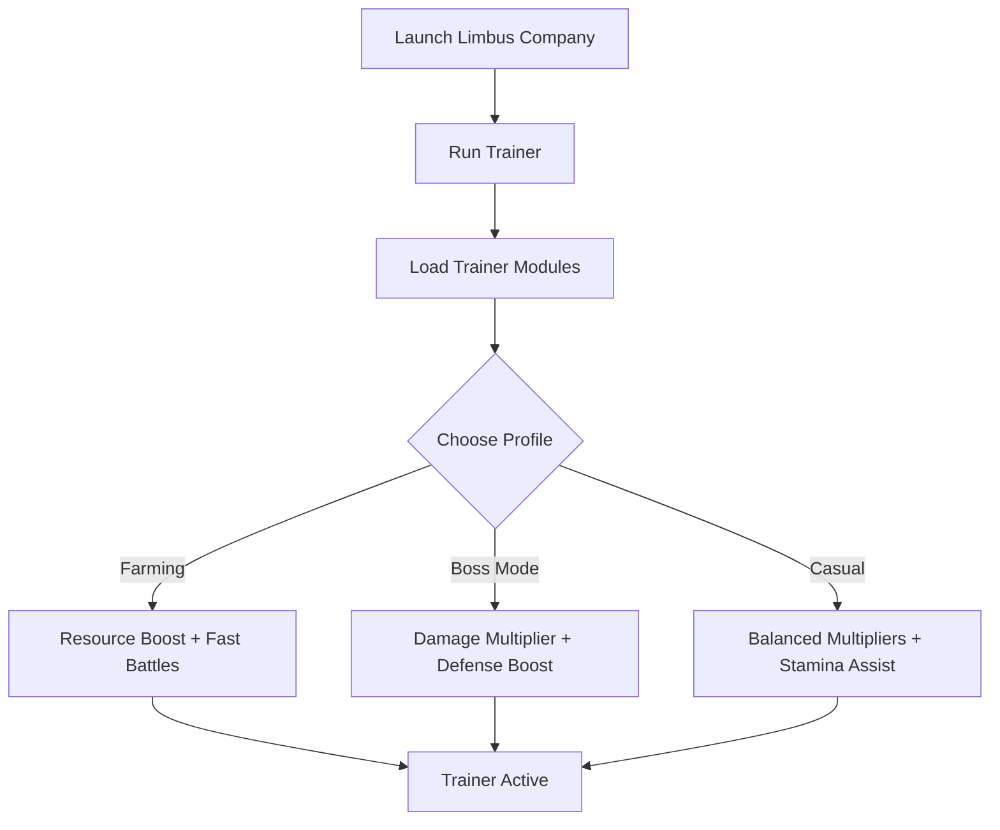

# Limbus Company Trainer 🌀

**Limbus Company** blends turn-based combat with real-time strategy, requiring sharp resource management and quick thinking. For players who want smoother progression, the **Limbus Company Trainer** introduces **combat assists, resource boosts, and hotkey-controlled overlays**, giving you an edge in both dungeons and story missions.

---

## 🌐 Overview

This trainer is a **single-player optimization tool** designed to streamline farming and combat flow. With unlimited resources, adjustable damage multipliers, and stamina control, you can create balanced or overpowered builds. Profiles allow you to quickly switch between farming mode, boss mode, and casual play.

---

## 🔑 Features

* ⚔️ **Combat Boosts** – Adjustable damage, defense, and hit rates.
* 💰 **Resource Control** – Infinite currency, shards, and upgrade materials.
* 🔋 **Stamina Assist** – Unlimited or frozen stamina for extended runs.
* 🕹 **Turn Manager** – Control turn speed for faster battles.
* 🗂 **Profile Loader** – Save presets for farming, bosses, or casual play.
* ⌨️ **Hotkey Switching** – Toggle trainer functions instantly.
* 🔒 **Stealth Injection** – Lightweight trainer for Windows 10/11.

---

[](#)
[](#)
[](#)
[](#)

---

## 🖥 Compatibility

| Platform       | Status        | Notes                                       |
| -------------- | ------------- | ------------------------------------------- |
| Windows 10     | ✅ Supported   | Stable builds                               |
| Windows 11     | ✅ Optimized   | Smoothest trainer performance               |
| Linux (Proton) | ⚠️ Partial    | Currency mods work, some combat boosts fail |
| macOS          | ❌ Unsupported | Requires VM workaround                      |

\[!NOTE]
The trainer works best with **Windows builds of Limbus Company**.

---

## ⚙️ Setup Guide

1. Download the Limbus Company Trainer package.

2. Extract files into a secure folder.

3. Launch Limbus Company.

4. Run the trainer with administrator rights:

   ```bash
   limbus_trainer.exe -game limbus.exe -mode overlay
   ```

5. Configure your `trainer.ini`:

   ```ini
   [Combat]
   DamageMultiplier=3
   DefenseBoost=2
   AlwaysHit=True

   [Resources]
   Currency=Unlimited
   Shards=9999
   Materials=Unlimited

   [Stamina]
   Unlimited=True
   ```

6. Press `F1` in-game to toggle the trainer overlay.

\[!IMPORTANT]
This trainer is for **single-player/story use only**—avoid online conflicts.

---

## 📊 Workflow Diagram



---

## 🎚 Example Configurations

**Farming Profile:**

```ini
Currency=Unlimited
Shards=9999
DamageMultiplier=2
```

**Boss Mode Profile:**

```ini
DamageMultiplier=5
DefenseBoost=3
AlwaysHit=True
```

**Casual Profile:**

```ini
DamageMultiplier=1.5
UnlimitedStamina=True
BalancedResources=True
```

\[!WARNING]
Using very high multipliers may trivialize gameplay—use moderation for balanced runs.

---

## ❓ FAQ

**Q: Does the trainer work in multiplayer modes?**
A: No, it’s intended for single-player/story only.

**Q: Can I swap configs mid-battle?**
A: Yes, hotkeys allow instant profile switching.

**Q: Does it affect FPS or stability?**
A: No, it’s optimized and lightweight (<3% performance impact).

**Q: Do updates follow patch cycles?**
A: Yes, trainer builds are updated with Limbus Company patches.

**Q: Can I reset values back to default?**
A: Yes, simply disable the trainer or press the reset option.

---

## 🚀 Final Thoughts

The **Limbus Company Trainer** empowers players with **combat assists, resource boosts, and stamina control** for smoother progression. Whether you’re farming shards, tackling bosses, or breezing through story content, it lets you experience the game exactly how you want.

[](#)
[](#)
[](#)

---
